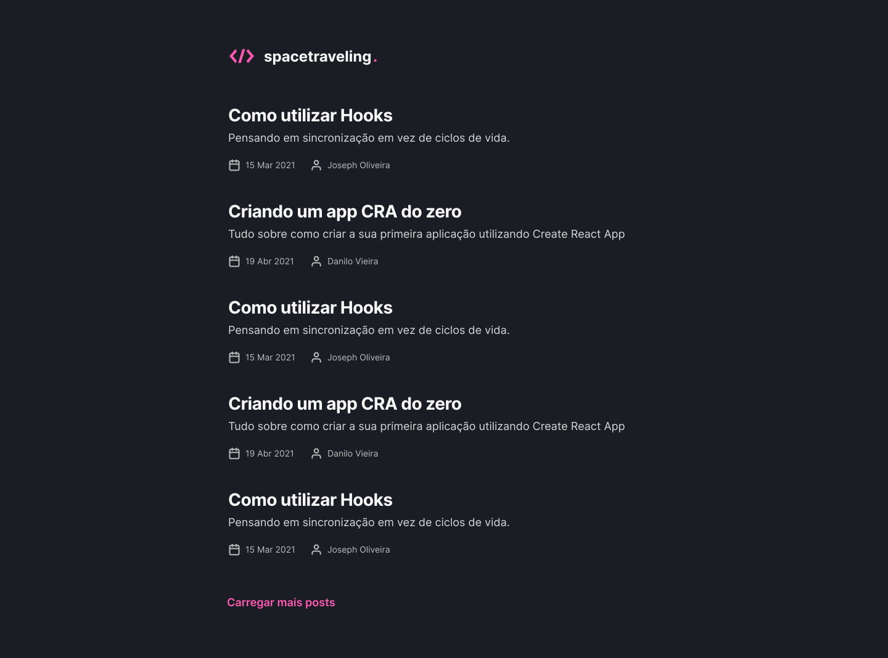

<p align="center">
  
</p>

<p align="center">
 <a href="#spacetraveling">Sobre</a> •
 <a href="#%EF%B8%8Ffuncionalidades">Funcionalidades</a> •
 <a href="#-layout">Layout</a> •
 <a href="#-como-executar-o-projeto">Como executar o projeto</a>  •
 <a href="#-tecnologias">Tecnologias</a>
</p>

# Spacetraveling

<p align="center">
  
</p>

Aplicação para colocar em prática conceitos aprendidos durante o módulo 3 do curso do Ignite da Rocketseat.
Objettivo é a criação de um Blog, onde o admin consegue criar novos posts e controlar os post existentes pelo **CMS** e o usuário final, consegue visualizar lista de posts existentes e navegar para dentro de um post especifico.

<h4 align="center"> 🚧 Spacetraveling ✅ Concluído 🚧 </h4>

## ⚙️Funcionalidades

- [x] Deve ser possível utilizar a fonte Inter e os seguintes tamanhos:
  - [x] Regular
  - [x] Semi Bold
  - [x] Bold
- [x] Deve ser possível visualizar os 20 primeiros posts
  - [x] Caso exista mais que 20 posts, o botão 'carregar mais posts' terá que realizar uma pesquisa assíncronas
- [x] Caso clique em um post, o usário deverá ser direcionado para todo o conteúdo do post

## 🎨 Layout

<p align="center" style="display: flex; align-items: flex-start; justify-content: center; gap: 8px ">
  
  
</p>

<a href="https://www.figma.com/file/D0dCXNNcvdhMVgn8ZczRPQ/Desafios-M%C3%B3dulo-3-ReactJS?node-id=0%3A1">
  
</a>

## 🚀 Como executar o projeto

### Pré-requisitos

Antes de começar, você vai precisar ter instalado em sua máquina as seguintes ferramentas:

- [Git](https://git-scm.com) e [Node.js](https://nodejs.org/en/);
- Precisa ter uma conta no [Prismic](https://prismic.io/);
- Depois de configurado conta e repositório do **Prismic**, terá que configurar conforme a tecnologia utilizada, que é o [Pirsmic com Next](https://prismic.io/docs/technologies/nextjs);
- Você precisa criar .env.local e popular a variável **PRISMIC_API_ENDPOINT** conforme as orientações do **prismic**
  > Exemplo: PRISMIC_API_ENDPOINT=https://meu-repositorio-criado-no-prismic/api/v2
- Você precisa colocar sua api no arquivo [sm.json](https://github.com/vitormarco/spacetraveling/blob/master/sm.json), no campo **apiEndpoint**
- Além disto é bom ter um editor para trabalhar com o código, como o [VSCode](https://code.visualstudio.com/).

Após tudo configurado e instalado

```bash
# Clone este repositório
$ git clone https://github.com/vitormarco/spacetraveling.git

# Acesse a pasta pelo terminal/cmd
$ cd spacetraveling

# execute comando para instalar as dependências
$ yarn
# ou
$ npm install

# execute o script para inicial o projeto
$ yarn dev

# ou
$ npm run dev
```

## 🛠 Tecnologias

As seguintes ferramentas foram usadas na construção do projeto:

- ✔️ [ReactJS](https://reactjs.org/)
- ✔️ [Typescript](https://www.typescriptlang.org/)
- ✔️ [Next](https://nextjs.org/docs/basic-features/typescript)
  - ✔️ [getStaticProps](https://nextjs.org/docs/basic-features/pages#static-generation-with-data)
  - ✔️ [getStaticPaths](https://nextjs.org/docs/basic-features/data-fetching/get-static-paths)
- ✔️ [Prismic](https://prismic.io/docs)
- ✔️ [Date-fns](https://date-fns.org/)

> Veja o arquivo [package.json](https://github.com/vitormarco/spacetraveling/blob/master/package.json)

Feito com 🧡 por Vítor Marco 👋🏽 [Entre em contato!](https://www.linkedin.com/in/vitor-marco/)
